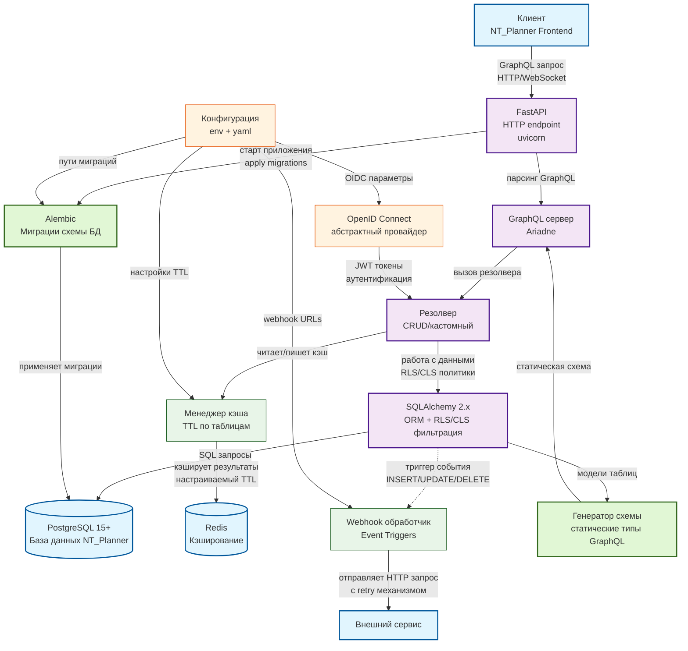
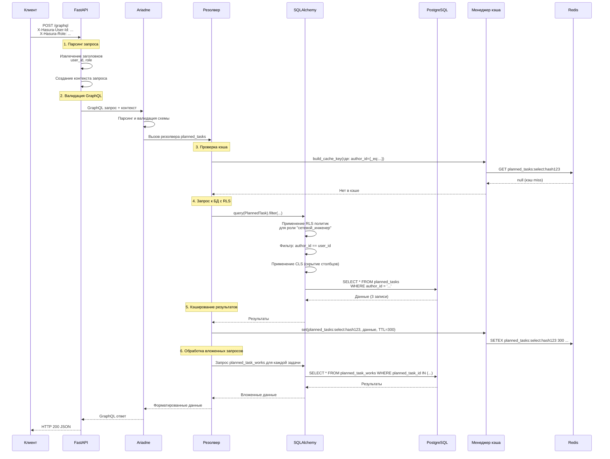

# Описание архитектурной диаграммы

## Общий обзор
Диаграмма представляет архитектуру GraphQL бэкенда NT_Planner, заменяющего Hasura. Система построена по многоуровневой архитектуре с четким разделением ответственности компонентов.

## Классификация компонентов

### 1. Внешние компоненты (синий цвет)
- **Клиент (NT_Planner Frontend)** - интерфейс пользователя, инициирующий GraphQL запросы
- **PostgreSQL 15+** - основное хранилище данных с 23 таблицами согласно схеме
- **Redis** - система кэширования для повышения производительности
- **Внешний сервис** - для обработки событий через webhooks

### 2. Основной поток обработки запросов (фиолетовый цвет)
**Цепочка обработки GraphQL запроса:**
```
Клиент → FastAPI → Ariadne → Резолвер → SQLAlchemy → PostgreSQL
```

**Компоненты:**
- **FastAPI с uvicorn** - HTTP-сервер, принимающий GraphQL запросы
- **Ariadne** - GraphQL сервер, парсящий и валидирующий запросы
- **Резолвер** - обработчик запросов (автогенерируемые CRUD + кастомные)
- **SQLAlchemy 2.x** - ORM с реализацией RLS/CLS политик

### 3. Дополнительные компоненты (зеленый цвет)
- **Менеджер кэша** - управление TTL кэширования по таблицам
- **Webhook обработчик** - аналог Hasura Event Triggers с механизмом повторных попыток

### 4. Компоненты миграций и схемы (темно-зеленый цвет)
- **Alembic** - система миграций схемы БД
- **Генератор схемы** - создание статических GraphQL типов из моделей SQLAlchemy

### 5. Вспомогательные компоненты (оранжевый цвет)
- **OpenID Connect** - абстрактный провайдер аутентификации
- **Конфигурация** - централизованное управление настройками (env + yaml)

## Ключевые взаимодействия

### Основной поток данных
1. **Запрос:** Клиент → HTTP/WebSocket → FastAPI
2. **Парсинг:** FastAPI → GraphQL запрос → Ariadne
3. **Обработка:** Ariadne → вызов резолвера → Резолвер
4. **Авторизация:** OIDC → SQLAlchemy (RLS/CLS)
5. **Выполнение:** SQLAlchemy → SQL запросы → PostgreSQL

### Кэширование (опционально)
- Резолверы используют менеджер кэша для чтения/записи результатов
- Настройка TTL осуществляется через конфигурацию
- Redis используется как бэкенд кэширования

### Система событий (асинхронно)
- SQLAlchemy детектирует изменения данных (INSERT/UPDATE/DELETE)
- Триггерится Webhook обработчик
- Отправка HTTP запросов с механизмом retry во внешние сервисы

### Инициализация и поддержка
- **При старте:** FastAPI запускает Alembic для применения миграций
- **Генерация схемы:** SQLAlchemy модели → статическая GraphQL схема → Ariadne
- **Конфигурация:** управляет всеми настраиваемыми параметрами системы

## Особенности реализации

### RLS/CLS политики
- Наследуются из Hasura metadata.json
- Применяются на уровне SQLAlchemy перед формированием SQL
- Интегрируются с OpenID Connect для определения прав пользователя

### Расширяемость
- Поддержка кастомных резолверов через декораторы
- Плагинная система для webhook обработчиков
- Абстрактный OIDC провайдер для гибкой интеграции

### Производительность
- Многоуровневое кэширование с настраиваемым TTL
- Статическая генерация GraphQL схемы при старте
- Оптимизация запросов через SQLAlchemy

## Технологический стек
- **Python 3.14** (в случае нестабильности перейду на 3.11)
- **FastAPI + Ariadne** для GraphQL API
- **SQLAlchemy 2.x + Alembic** для работы с БД и миграций
- **Redis** для кэширования
- **PostgreSQL 15+** как основная БД

Система обеспечивает полную совместимость с существующим Hasura API NT_Planner при сохранении возможности горизонтального масштабирования.


